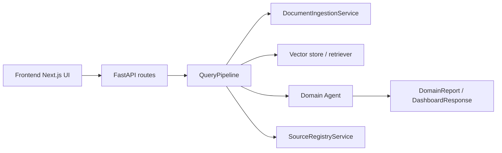
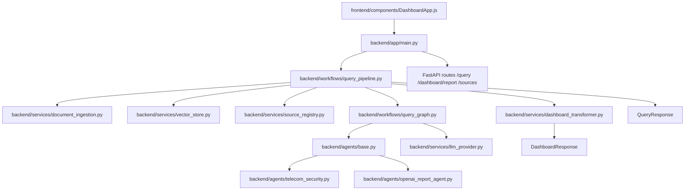

# loopLamp repository documentation

## 1. What this repository is

loopLamp is a backend-first, document-driven domain reporting application. It ingests local documents, builds a retrieval layer over them, selects a domain-focused agent, and returns either:

- a structured report for API consumers, or
- a dashboard-ready payload for the frontend UI.

The project is intentionally layered so the core API contract remains stable while the retrieval and generation stack can evolve from lightweight local fallbacks toward richer LangChain/LangGraph/OpenAI-based orchestration.

---

## 2. High-level architecture

### Runtime flow

### Main responsibilities

- Frontend: present a dashboard and collect user input.
- Backend API: validate requests, expose source management endpoints, and orchestrate report generation.
- Services: ingest files, manage retrieval, persist source metadata, and optionally use LLM providers.
- Workflows: decide how retrieval, comparison, evidence review, and report generation are sequenced.
- Agents: translate retrieved context into domain-specific reports.

---

## 3. Folder-wise overview

### Root folder

Files and directories at the repository root configure packaging, environment, and developer workflows.

Key items:

- [README.md](README.md): product summary and quick start.
- [ARCHITECTURE.md](ARCHITECTURE.md): architecture and request flow.
- [API_USAGE.md](API_USAGE.md): API usage examples.
- [DEPLOYMENT.md](DEPLOYMENT.md): deployment notes.
- [pyproject.toml](pyproject.toml): Python packaging metadata.
- [requirements.txt](requirements.txt): Python dependencies.
- [bootstrap.sh](bootstrap.sh): bootstrap and setup helper.
- [docker-compose.yml](docker-compose.yml): containerized local run setup.
- [conftest.py](conftest.py): pytest fixture and import configuration.

### backend/

This is the main application package. It contains the HTTP entrypoint, core data models, services, workflows, agents, guards, and tests.

Subfolders:

- [backend/app](backend/app): FastAPI app and route definitions.
- [backend/core](backend/core): shared schemas, data contracts, and domain catalog.
- [backend/services](backend/services): ingestion, retrieval, vector store, LLM provider, dashboard transformation, and source registry.
- [backend/workflows](backend/workflows): orchestration logic and graph-style execution flow.
- [backend/agents](backend/agents): domain-specific report generation logic.
- [backend/guards](backend/guards): execution guard and reflection helpers.
- [backend/tests](backend/tests): regression and integration tests.

### frontend/

This is a lightweight Next.js UI that lets users:

- choose a saved source,
- upload a new source,
- run a dashboard report,
- inspect execution metadata and evidence cards.

Key items:

- [frontend/app](frontend/app): Next.js app router entrypoints.
- [frontend/components](frontend/components): dashboard client component.
- [frontend/lib](frontend/lib): UI helper functions and defaults.
- [frontend/tests](frontend/tests): small frontend tests.

### test_data/

Contains sample documents for telecom, finance, healthcare, banking, automotive, manufacturing, and ecommerce scenarios. These are used by the source registry and local demos.

### uploaded_sources/

Stores uploaded files and a small SQLite-backed index of uploaded source metadata. This is the persistence layer for user-provided documents.

### qdrant_storage/

Persistent vector-store storage directory used when the Qdrant-backed retrieval path is available.

---

## 4. File-wise breakdown

### Root-level files

- [README.md](README.md): high-level overview, setup, and usage.
- [ARCHITECTURE.md](ARCHITECTURE.md): higher-level system design and API flow.
- [API_USAGE.md](API_USAGE.md): concrete request/response examples.
- [DEPLOYMENT.md](DEPLOYMENT.md): local, Docker, and environment details.
- [bootstrap.sh](bootstrap.sh): bootstraps Python environment and common setup steps.
- [docker-compose.yml](docker-compose.yml): spins up API and frontend containers.
- [requirements.txt](requirements.txt): pinned runtime dependencies.
- [pyproject.toml](pyproject.toml): packaging metadata for the Python backend package.

### Backend app layer

- [backend/app/main.py](backend/app/main.py): FastAPI application entrypoint. Defines routes for health checks, source management, query execution, and dashboard generation.

Why it matters:
- This is the main API façade.
- It centralizes CORS setup and input validation error handling.
- It wires HTTP requests into the query pipeline and source registry.

### Backend core models

- [backend/core/models.py](backend/core/models.py): Pydantic schemas for domain reports, execution metadata, dashboard payloads, query requests, and source records.
- [backend/core/documents.py](backend/core/documents.py): minimal document contract used across ingestion, retrieval, and agents.
- [backend/core/domain_catalog.py](backend/core/domain_catalog.py): registry of supported domains and sample data.

Why it matters:
- These models create a structured contract between layers.
- They improve validation, documentation, and future extensibility.

### Backend services

- [backend/services/document_ingestion.py](backend/services/document_ingestion.py): reads .txt, .md, .pdf, .csv, .json and turns them into document chunks.
- [backend/services/vector_store.py](backend/services/vector_store.py): builds a retrieval backend. Supports an in-memory fallback, optional LangChain embeddings, and optional Qdrant persistence.
- [backend/services/retrieval.py](backend/services/retrieval.py): thin retrieval wrapper over the active vector store.
- [backend/services/source_registry.py](backend/services/source_registry.py): manages sample and uploaded sources, tracks indexing state, and persists metadata in SQLite + JSON.
- [backend/services/llm_provider.py](backend/services/llm_provider.py): abstraction for LLM-backed report generation using OpenAI-compatible providers.
- [backend/services/dashboard_transformer.py](backend/services/dashboard_transformer.py): converts report output into a UI-friendly dashboard shape.
- [backend/services/report_evaluator.py](backend/services/report_evaluator.py): evaluates report grounding, source coverage, and graph-state completeness.

Why they matter:
- Services isolate infrastructure concerns from domain logic.
- They let the app run even when optional AI dependencies are missing.

### Backend workflows

- [backend/workflows/query_pipeline.py](backend/workflows/query_pipeline.py): high-level orchestration for request handling, source resolution, chinking, indexing, agent selection, and response assembly.
- [backend/workflows/query_graph.py](backend/workflows/query_graph.py): graph-style execution workflow with a fallback path. It adds retrieve-plan-compare-summarize-inspect-generate steps and a reflection loop.

Why they matter:
- The workflow layer is the “brain” of the application.
- It keeps the runtime process explicit and makes future LangGraph migration straightforward.

### Backend agents

- [backend/agents/base.py](backend/agents/base.py): abstract contract for all domain agents.
- [backend/agents/telecom_security.py](backend/agents/telecom_security.py): telecom-specific deterministic logic.
- [backend/agents/financial_risk.py](backend/agents/financial_risk.py): financial risk example agent.
- [backend/agents/medical_qa.py](backend/agents/medical_qa.py): medical question-answering example agent.
- [backend/agents/banking_assistant.py](backend/agents/banking_assistant.py): banking assistant example.
- [backend/agents/automotive.py](backend/agents/automotive.py): automotive example.
- [backend/agents/manufacturing.py](backend/agents/manufacturing.py): manufacturing example.
- [backend/agents/ecommerce.py](backend/agents/ecommerce.py): ecommerce example.
- [backend/agents/openai_report_agent.py](backend/agents/openai_report_agent.py): OpenAI-backed report agent.
- [backend/agents/tool_calling_report_agent.py](backend/agents/tool_calling_report_agent.py): richer agent that can plan retrieval and inspect evidence before generating a final report.
- [backend/agents/csv_agent.py](backend/agents/csv_agent.py): small exploratory CSV helper.

Why they matter:
- Domain logic is isolated from orchestration logic.
- The project is already structured for multi-domain extension.

### Backend guards

- [backend/guards/execution.py](backend/guards/execution.py): guard wrapper for reflection-driven execution and grounding checks.

Why it matters:
- It makes the workflow more robust by retrying when the answer is weakly grounded.

### Frontend files

- [frontend/app/page.js](frontend/app/page.js): entry page that renders the dashboard UI.
- [frontend/components/DashboardApp.js](frontend/components/DashboardApp.js): main React component for form handling, source management, and result rendering.
- [frontend/lib/dashboard.js](frontend/lib/dashboard.js): helper functions for source grouping, formatting, and error handling.
- [frontend/app/layout.js](frontend/app/layout.js): application shell and global styles binding.
- [frontend/app/globals.css](frontend/app/globals.css): styling for the dashboard UI.

---

## 5. Libraries and frameworks in use

### Backend

- FastAPI: HTTP API and OpenAPI docs.
- Pydantic: request/response validation and structured schema contracts.
- Uvicorn: ASGI server for running the API.
- pandas: CSV ingestion and structured preprocessing.
- pytest: automated regression testing.
- pypdf: PDF text extraction when available.
- langchain_text_splitters: chunking when the optional dependency is present.
- langgraph: optional graph-based workflow backend.
- openai: optional LLM provider integration.
- qdrant-client: optional persistent vector-store integration.
- sentence-transformers: optional embedding generation for semantic retrieval.

### Frontend

- Next.js: app router and React-based UI shell.
- React: dashboard component state and UI rendering.

### Why these libraries were chosen

- FastAPI + Pydantic keep the API fast, typed, and self-documenting.
- pandas makes CSV handling straightforward.
- Optional LLM/vector dependencies make the system extensible without breaking local development.
- Next.js keeps the UI light and simple while staying close to the backend API contract.

---

## 6. Key classes and what they do

### Core classes

- DomainReport: normalized report contract for agents.
- QueryRequest: API input payload.
- QueryResponse: API output payload.
- DashboardResponse: frontend-friendly summary payload.
- SourceRecord: source metadata model for the registry.

### Workflow classes

- QueryPipeline: orchestrates ingestion, retrieval, agent selection, and response building.
- QueryGraphWorkflow: executes a graph-like reasoning loop with reflection support.
- QueryWorkflowState: carries state between workflow steps.

### Service classes

- DocumentIngestionService: entrypoint for file-based ingestion.
- SourceRegistryService: source catalog, upload persistence, and index-state tracking.
- InMemoryVectorStore: lightweight lexical retrieval fallback.
- LangChainEmbeddingVectorStore: embedding-backed retrieval when dependencies are available.
- QdrantPersistentVectorStore: persistent vector storage and indexing.
- OpenAIResponsesReportProvider: structured LLM-backed report generation.

### Agent classes

- DomainAgent: common interface for all domain agents.
- TelecomSecurityAgent, FinancialRiskAgent, MedicalQAAgent, BankingAssistantAgent, AutomotiveAgent, ManufacturingAgent, EcommerceAgent: deterministic domain examples.
- OpenAIReportAgent: LLM-backed report generator that can fall back to a deterministic agent.
- ToolCallingReportAgent: richer agent with retrieval-planning and evidence-review capabilities.

---

## 7. How the pieces are wired together

### A. Frontend to backend

1. The React dashboard calls the backend API from [frontend/components/DashboardApp.js](frontend/components/DashboardApp.js).
2. Requests go to routes in [backend/app/main.py](backend/app/main.py):
   - /sources
   - /sources/upload
   - /sources/{source_id}/reindex
   - /query
   - /dashboard/report
3. The API uses the shared query pipeline to produce a final response.

### B. Request handling

1. A request arrives as a QueryRequest.
2. QueryPipeline resolves whether the user selected a specific source or wants all sources in a domain.
3. The ingestion service reads the document(s) and produces chunks.
4. The vector store builds a retriever over those chunks.
5. The selected agent generates a report.
6. The workflow records execution metadata and evaluation outcomes.
7. The API returns either a QueryResponse or a DashboardResponse.

### C. Source lifecycle

1. The source registry enumerates sample data from the domain catalog and uploaded files from the uploads directory.
2. Uploads are written to [uploaded_sources](uploaded_sources) and recorded in SQLite.
3. Reindexing rebuilds the vector index for the selected source.
4. Index state (indexed / failed / not indexed) is persisted for later UI display.

### D. Retrieval strategy

The retrieval layer is intentionally layered:

- first try Qdrant persistence,
- otherwise try LangChain embeddings,
- otherwise fall back to simple in-memory lexical matching.

That makes the app usable even if optional dependencies are missing.

---

## 8. Best practices already followed

### 1. Separation of concerns

The codebase cleanly separates:

- HTTP handling in the app layer,
- domain contracts in core,
- infrastructure in services,
- orchestration in workflows,
- domain behavior in agents.

This makes it easier to extend the project without creating a tangled monolith.

### 2. Contract-first design with Pydantic

The system relies on explicit schemas instead of loosely-typed dictionaries. That improves:

- validation,
- documentation,
- safer API evolution,
- frontend/backend alignment.

### 3. Graceful fallbacks

The app is designed to work in minimal environments. If OpenAI, LangChain, LangGraph, or Qdrant are unavailable, it falls back to deterministic logic or in-memory retrieval.

This is an important best practice for buildable prototypes and local development.

### 4. Defensive input handling

The upload endpoint validates file types, rejects ZIP-like content disguised as text/CSV/JSON, and uses explicit error responses.

### 5. Persistence and state tracking

The source registry tracks uploaded sources and index status, which makes the UI more reliable and reduces repeated indexing work.

### 6. Observability and traceability

Execution metadata, agent traces, and evaluation output are stored and surfaced to the UI. This makes debugging and auditing much easier than a black-box LLM pipeline.

### 7. Test coverage

The repository has pytest-based tests for:

- API routes,
- upload and deletion flows,
- ingestion behavior,
- retrieval behavior,
- dashboard generation,
- CORS and source registry logic.

### 8. Extensibility for future growth

The code is already prepared for:

- more domains,
- more agent types,
- richer LLM workflows,
- vector database swaps,
- LangGraph migration.

---

## 9. Current maturity and likely next steps

This repository is already a solid scaffold for an agentic RAG system. It has a clear structure and a working local flow, but it is still best described as a strong prototype rather than a fully hardened production platform.

Suggested next steps:

- add more domain-specific agents and richer prompts,
- add authentication and authorization,
- introduce a proper database for production persistence,
- add background worker queues for indexing and report generation,
- formalize monitoring, rate limiting, and logging,
- move from local fallback retrieval to a fully managed embedding + vector backend in production.

---

## 10. Quick mental model

If you want the shortest possible summary, think of the system as:

- UI collects a query and optional source selection,
- API routes forward the request into the query pipeline,
- ingestion feeds the retriever,
- the agent generates a report,
- the dashboard transformer presents a UI-ready view,
- the source registry persists and indexes user-uploaded content.

---

## 11. Bibliography and reference points for the libraries and frameworks used

The following references map the main libraries and frameworks in this repository to the files where they are used, their role in the system, and the official documentation entry points.

1. FastAPI
   - Used in [backend/app/main.py](backend/app/main.py) for the HTTP API, routing, and CORS configuration.
   - Why it matters: it provides the main web interface for queries, source management, and dashboard generation.
   - Documentation: https://fastapi.tiangolo.com/

2. Pydantic
   - Used in [backend/core/models.py](backend/core/models.py) for request/response validation and structured report schemas.
   - Why it matters: it keeps the API contract explicit, typed, and self-documenting.
   - Documentation: https://docs.pydantic.dev/latest/

3. Uvicorn
   - Used to run the FastAPI application locally as an ASGI server.
   - Why it matters: it serves the backend in development and production-style environments.
   - Documentation: https://www.uvicorn.org/

4. pandas
   - Used in [backend/services/document_ingestion.py](backend/services/document_ingestion.py) for CSV ingestion and table normalization.
   - Why it matters: it makes structured data ingestion straightforward and reliable.
   - Documentation: https://pandas.pydata.org/docs/

5. pytest
   - Used across [backend/tests](backend/tests) for regression and integration testing.
   - Why it matters: it establishes a repeatable test harness for the backend behavior.
   - Documentation: https://docs.pytest.org/en/stable/

6. LangChain text splitters
   - Used in [backend/services/document_ingestion.py](backend/services/document_ingestion.py) when available to split large text into smaller chunks.
   - Why it matters: chunking improves retrieval quality by creating smaller, more focused context units.
   - Documentation: https://python.langchain.com/docs/concepts/text_splitters/

7. LangGraph
   - Used in [backend/workflows/query_graph.py](backend/workflows/query_graph.py) as the graph-based workflow backend when installed.
   - Why it matters: it enables structured multi-step reasoning and a more explicit execution graph.
   - Documentation: https://langchain-ai.github.io/langgraph/

8. OpenAI Python SDK
   - Used in [backend/services/llm_provider.py](backend/services/llm_provider.py) for structured report generation through the OpenAI Responses API.
   - Why it matters: it enables stronger LLM-based report synthesis when an API key is configured.
   - Documentation: https://github.com/openai/openai-python
   - API reference: https://platform.openai.com/docs/api-reference

9. Qdrant client
   - Used in [backend/services/vector_store.py](backend/services/vector_store.py) for persistent vector storage and indexing.
   - Why it matters: it allows the system to scale from in-memory retrieval to a more durable vector database setup.
   - Documentation: https://qdrant.tech/documentation/
   - Quickstart: https://qdrant.tech/documentation/quickstart/

10. sentence-transformers
    - Used in [backend/services/vector_store.py](backend/services/vector_store.py) for embedding-based retrieval when available.
    - Why it matters: it provides semantic embeddings that improve similarity search beyond simple keyword matching.
    - Documentation: https://www.sbert.net/

11. Next.js
    - Used in [frontend/app](frontend/app), [frontend/components](frontend/components), and [frontend/package.json](frontend/package.json) for the dashboard UI.
    - Why it matters: it provides the lightweight React-based frontend shell and routing model.
    - Documentation: https://nextjs.org/docs

12. React
    - Used in [frontend/components/DashboardApp.js](frontend/components/DashboardApp.js) for the interactive dashboard experience.
    - Why it matters: it powers the component state, form behavior, and result rendering in the UI.
    - Documentation: https://react.dev/reference

---

## 12. Behavioral markup: how the repo behaves at runtime

The repository is not just a collection of folders; it behaves like a layered pipeline with clear responsibilities. The following markup captures the runtime behavior of the most important files and the way they connect.

### File-by-file behavior and wiring

1. [frontend/components/DashboardApp.js](frontend/components/DashboardApp.js)
   - Owns the dashboard UI state.
   - Calls the backend for source listing, upload, delete, reindex, query, and dashboard-report generation.
   - Uses local React state to render metrics, highlights, evidence cards, execution metadata, and source status.

2. [frontend/app/page.js](frontend/app/page.js)
   - Acts as the page entrypoint.
   - Renders the dashboard component into the app router page.

3. [backend/app/main.py](backend/app/main.py)
   - Defines the FastAPI app and all route handlers.
   - Handles startup synchronization, file upload validation, source management, query execution, and dashboard transformation.
   - Converts raised errors into HTTPException responses, keeping API behavior predictable.

4. [backend/core/models.py](backend/core/models.py)
   - Provides the contract layer for requests, responses, reports, evaluation, and dashboard payloads.
   - Ensures that API payloads are consistent across frontend and backend.

5. [backend/core/documents.py](backend/core/documents.py)
   - Provides the minimal document abstraction used throughout the app.
   - Keeps ingestion, retrieval, and agent pipelines working against one common shape.

6. [backend/workflows/query_pipeline.py](backend/workflows/query_pipeline.py)
   - This is the orchestration entrypoint for most user requests.
   - It resolves the source set, ingests documents, builds a vector DB, selects an agent, runs the workflow, evaluates the result, and returns a structured response.
   - It is the central “controller” for request handling.

7. [backend/workflows/query_graph.py](backend/workflows/query_graph.py)
   - Implements a graph-style execution loop.
   - The logic follows retrieve -> plan -> optional retrieve additional sources -> compare -> summarize -> inspect -> generate -> reflect/finish.
   - This makes the reasoning loop explicit and extensible.

8. [backend/services/document_ingestion.py](backend/services/document_ingestion.py)
   - Reads local files and turns them into document chunks.
   - Supports .txt, .md, .pdf, .csv, and .json.
   - Uses a LangChain splitter when available and falls back to a custom chunker when it is not.

9. [backend/services/vector_store.py](backend/services/vector_store.py)
   - Chooses the retrieval backend dynamically.
   - Preferred order is Qdrant persistence, then LangChain embeddings, then in-memory lexical matching.
   - This is a strong example of graceful degradation and progressive enhancement.

10. [backend/services/retrieval.py](backend/services/retrieval.py)
    - Provides a thin retrieval wrapper over the active vector store.
    - Keeps the workflow layer from depending directly on the concrete retrieval implementation.

11. [backend/services/source_registry.py](backend/services/source_registry.py)
    - Manages the source catalog.
    - Reads sample sources from the domain catalog, persists uploaded files, and tracks indexing state in SQLite.
    - This keeps source inventory and UI state consistent.

12. [backend/services/llm_provider.py](backend/services/llm_provider.py)
    - Wraps LLM interaction behind a provider abstraction.
    - Supports structured JSON-schema-based output generation and fallback behavior.
    - This is a good example of isolating AI-specific behavior from core workflow logic.

13. [backend/services/dashboard_transformer.py](backend/services/dashboard_transformer.py)
    - Converts a QueryResponse into a DashboardResponse.
    - This is how the backend translates raw report output into a UI-friendly shape.

14. [backend/services/report_evaluator.py](backend/services/report_evaluator.py)
    - Evaluates whether the generated report is grounded and whether the execution metadata contains the expected graph-state fields.
    - This adds quality control and observability to the pipeline.

15. [backend/agents/base.py](backend/agents/base.py)
    - Defines the abstract contract for all domain agents.
    - Standardizes methods such as run, plan_retrieval, inspect_evidence, compare_sources, and summarize_evidence.

16. [backend/agents/telecom_security.py](backend/agents/telecom_security.py) and other domain agent files
    - Implement deterministic domain-specific reporting logic.
    - They are isolated from workflow orchestration, which keeps business logic decoupled from execution mechanics.

17. [backend/agents/openai_report_agent.py](backend/agents/openai_report_agent.py)
    - Adds optional LLM-backed report generation.
    - It can fall back to deterministic logic when the provider is unavailable.

18. [backend/agents/tool_calling_report_agent.py](backend/agents/tool_calling_report_agent.py)
    - Extends the agent abstraction with richer tool-use behavior.
    - It can plan retrieval, compare evidence sources, and summarize context before final report generation.

19. [backend/guards/execution.py](backend/guards/execution.py)
    - Adds guard-like execution behavior for reflection-based retries.
    - It reinforces the idea that answer quality should be checked before the workflow finishes.

### Best practices visible in the implementation

- Separation of concerns: API layer, workflow layer, service layer, and agent layer are intentionally distinct.
- Contract-first design: Pydantic models define the shape of data flowing between modules.
- Progressive enhancement: the system works with local fallbacks before optional AI/vector dependencies are installed.
- Defensive programming: file validation, error handling, and fallback branches are explicit rather than implicit.
- Observability: execution metadata, trace steps, and evaluation output make debugging easier.
- Extensibility: new domains and new agent behaviors can be added without changing the core API contract.
- Testability: the repository includes test coverage for key flows such as API routing, ingestion, retrieval, and source lifecycle.

### Practical mental model

If you think of the project as a pipeline, it looks like this:

- User interacts with the dashboard UI.
- The React component sends a request to the FastAPI backend.
- QueryPipeline resolves the source set and builds the retrieval context.
- QueryGraphWorkflow executes the reasoning loop.
- An agent turns the retrieved evidence into a structured report.
- The dashboard transformer reshapes the report for the frontend.
- The UI renders the final experience.
